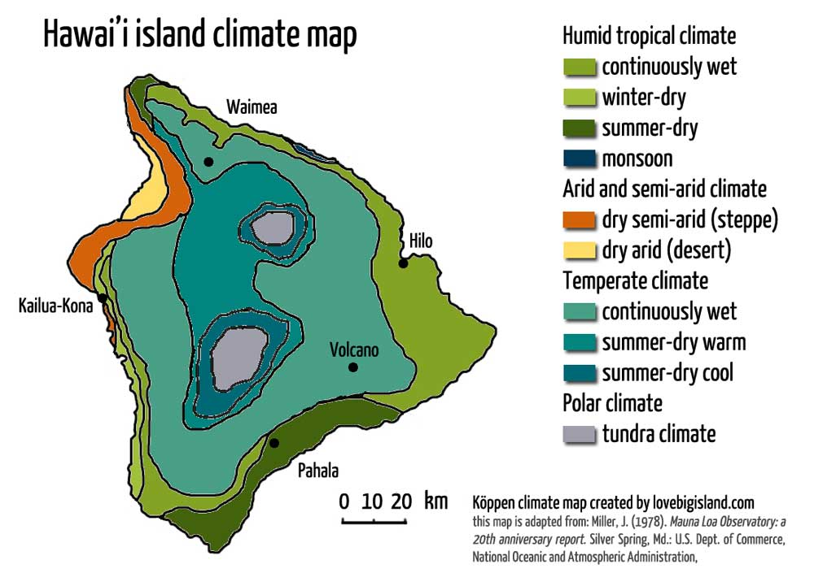

# SQLAlchemy Climate Analysis and Flask API Challenge

## Project Overview

This project involves performing a climate analysis of Honolulu, Hawaii using Python, SQLAlchemy ORM, and Flask API. The project is divided into two main parts:

1. **Climate Data Analysis**: Using Python and SQLAlchemy to perform a basic climate analysis and data exploration of the climate database.
2. **Flask API Development**: Creating a Flask API based on the queries developed from the climate analysis.

## Repository Structure

- `App.ipynb`: Jupyter notebook containing the main scripts to perform climate data analysis using Python and SQLAlchemy.
- `app.py`: Flask application that provides API routes to access climate data.
- `hawaii.sqlite`: SQLite database containing the climate data.
- `hawaii_measurements.csv`: CSV file containing measurements data.
- `hawaii_stations.csv`: CSV file containing stations data.
- `Resources/`: Directory containing data files required for the analysis.
- `Figures/`: Directory containing images generated from the analysis.

## Instructions

### Part 1: Analyze and Explore the Climate Data

- Connect to the SQLite database using SQLAlchemy.
- Reflect the tables into classes and save references.
- Perform precipitation and station analysis using SQLAlchemy ORM queries.
- Plot the results using Matplotlib.
- Print summary statistics using Pandas.

### Part 2: Design Your Climate App

- Create a Flask API with routes to provide access to the climate data.
- Implement the following routes:
  - `/api/v1.0/precipitation`: Returns precipitation data for the last year.
  - `/api/v1.0/stations`: Returns a list of all stations.
  - `/api/v1.0/tobs`: Returns temperature observations for the most active station for the last year.
  - `/api/v1.0/<start>` and `/api/v1.0/<start>/<end>`: Returns the minimum, average, and maximum temperatures for a specified start or start-end range.

## Requirements

- Python 3.x
- SQLAlchemy
- Pandas
- Matplotlib
- Flask

## How to Run

1. Clone the repository to your local machine.
2. Ensure all the required files (`hawaii.sqlite`, `hawaii_measurements.csv`, `hawaii_stations.csv`) are in the `Resources` directory.
3. Open `App.ipynb` to view the climate data analysis and generate the plots.
4. Run the `app.py` file to start the Flask API server and access the API routes.

## API Endpoints

- `/`: Home page listing all available routes.
- `/api/v1.0/precipitation`: Precipitation data for the last year.
- `/api/v1.0/stations`: List of all stations.
- `/api/v1.0/tobs`: Temperature observations for the most active station for the last year.
- `/api/v1.0/<start>`: Minimum, average, and maximum temperatures from the start date.
- `/api/v1.0/<start>/<end>`: Minimum, average, and maximum temperatures from the start date to the end date.

## Acknowledgments

This project was developed as part of the SQLAlchemy Challenge for the Data Analytics Bootcamp.
